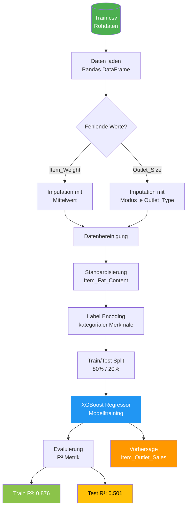

# Big Mart Umsatzprognose

## Einführung

Dieses Projekt beschäftigt sich mit der Vorhersage von Produktverkäufen in verschiedenen Filialen der Supermarktkette „Big Mart" mithilfe von Methoden des maschinellen Lernens. Der zugrunde liegende Datensatz umfasst über 8.500 Einträge mit detaillierten Informationen zu Produkteigenschaften – wie Gewicht, Fettgehalt, Sichtbarkeit im Regal und Preis – sowie zu den jeweiligen Filialen, darunter Größe, Standorttyp und Gründungsjahr. Ziel ist es, ein robustes Regressionsmodell zu entwickeln, das den Umsatz eines Produkts in einer bestimmten Filiale (`Item_Outlet_Sales`) möglichst präzise vorhersagen kann. Solche Prognosen sind für Einzelhandelsunternehmen von großer Bedeutung, da sie eine datengestützte Optimierung der Lagerbestände, der Filialplanung und der Marketingstrategien ermöglichen. Im Rahmen dieses Projekts werden die Daten umfassend vorverarbeitet, fehlende Werte behandelt, kategoriale Merkmale kodiert und schließlich ein **XGBoost Regressor** trainiert und evaluiert.

## Projektübersicht
Dieses Projekt zielt darauf ab, die Verkäufe verschiedener Produkte in verschiedenen Big Mart-Filialen vorherzusagen. Der Datensatz enthält Informationen über Produkte, deren Eigenschaften und die Filialen, in denen sie verkauft werden. Das Ziel ist es, ein maschinelles Lernmodell zu entwickeln, das den `Item_Outlet_Sales` genau vorhersagen kann.

## Architekturdiagramm

## Datensatz
Der für dieses Projekt verwendete Datensatz ist `Train.csv` und enthält verschiedene Merkmale im Zusammenhang mit Produkten und Filialen.

### Merkmale:
*   **Item_Identifier**: Eindeutige Produkt-ID
*   **Item_Weight**: Gewicht des Produkts
*   **Item_Fat_Content**: Fettgehalt des Produkts (z. B. Low Fat, Regular)
*   **Item_Visibility**: Der Prozentsatz der gesamten Ausstellungsfläche, der einem bestimmten Produkt in einem Geschäft zugewiesen ist
*   **Item_Type**: Die Kategorie, zu der das Produkt gehört
*   **Item_MRP**: Maximaler Einzelhandelspreis (MRP) des Produkts
*   **Outlet_Identifier**: Eindeutige Filial-ID
*   **Outlet_Establishment_Year**: Das Jahr, in dem die Filiale gegründet wurde
*   **Outlet_Size**: Die Größe der Filiale (Small, Medium, High)
*   **Outlet_Location_Type**: Der Typ der Stadt, in der sich die Filiale befindet
*   **Outlet_Type**: Der Typ der Filiale
*   **Item_Outlet_Sales**: Verkäufe des Produkts in einem bestimmten Geschäft (Zielvariable)

## Datenvorverarbeitung
Die folgenden Schritte wurden durchgeführt, um die Daten für das Modelltraining vorzubereiten:

1.  **Umgang mit fehlenden Werten**:
    *   Fehlende Werte in `Item_Weight` wurden mit dem Mittelwert der Spalte imputiert.
    *   Fehlende Werte in `Outlet_Size` wurden basierend auf dem Modus von `Outlet_Size` für jeden `Outlet_Type` imputiert.
2.  **Datenbereinigung**:
    *   Inkonsistente Einträge in `Item_Fat_Content` (z. B. 'LF', 'low fat', 'reg') wurden zu 'Low Fat' und 'Regular' standardisiert.
3.  **Label-Kodierung**:
    *   Alle kategorialen Merkmale (`Item_Identifier`, `Item_Fat_Content`, `Item_Type`, `Outlet_Identifier`, `Outlet_Size`, `Outlet_Location_Type`, `Outlet_Type`) wurden mithilfe von `LabelEncoder` in numerische Darstellungen umgewandelt.

## Modelltraining

1.  **Datensplit**: Der Datensatz wurde in Trainings- und Testsets aufgeteilt, mit einer Testgröße von 20% und `random_state=2`.
2.  **Modell**: Ein XGBoost Regressor-Modell wurde für das Training verwendet.
3.  **Evaluierung**: Die Leistung des Modells wurde mithilfe der R-Quadrat-Metrik sowohl auf den Trainings- als auch auf den Testdaten bewertet.

    *   Trainingsdaten R-Quadrat: 0.876
    *   Testdaten R-Quadrat: 0.501

## Abhängigkeiten
*   `numpy`
*   `pandas`
*   `matplotlib`
*   `seaborn`
*   `scikit-learn` (für `LabelEncoder`, `train_test_split`, `metrics`)
*   `xgboost` (für `XGBRegressor`)
